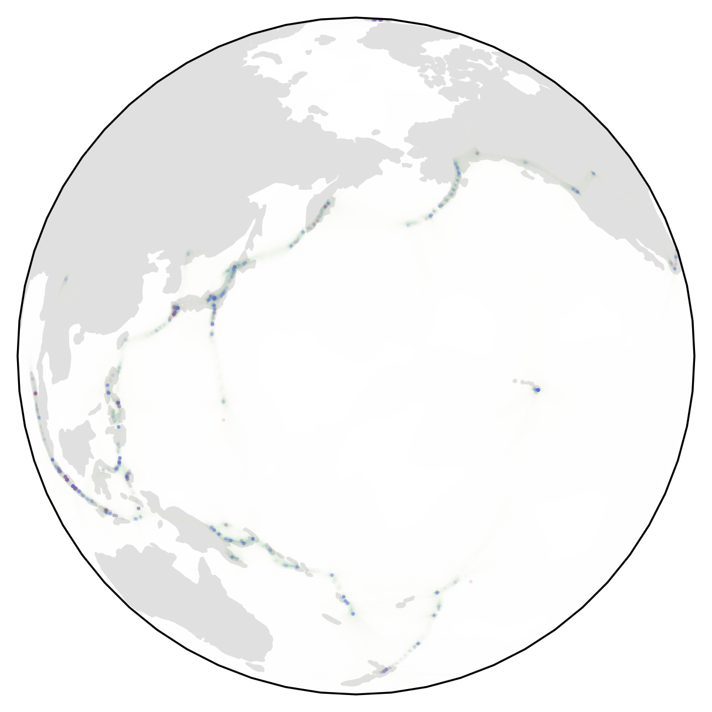
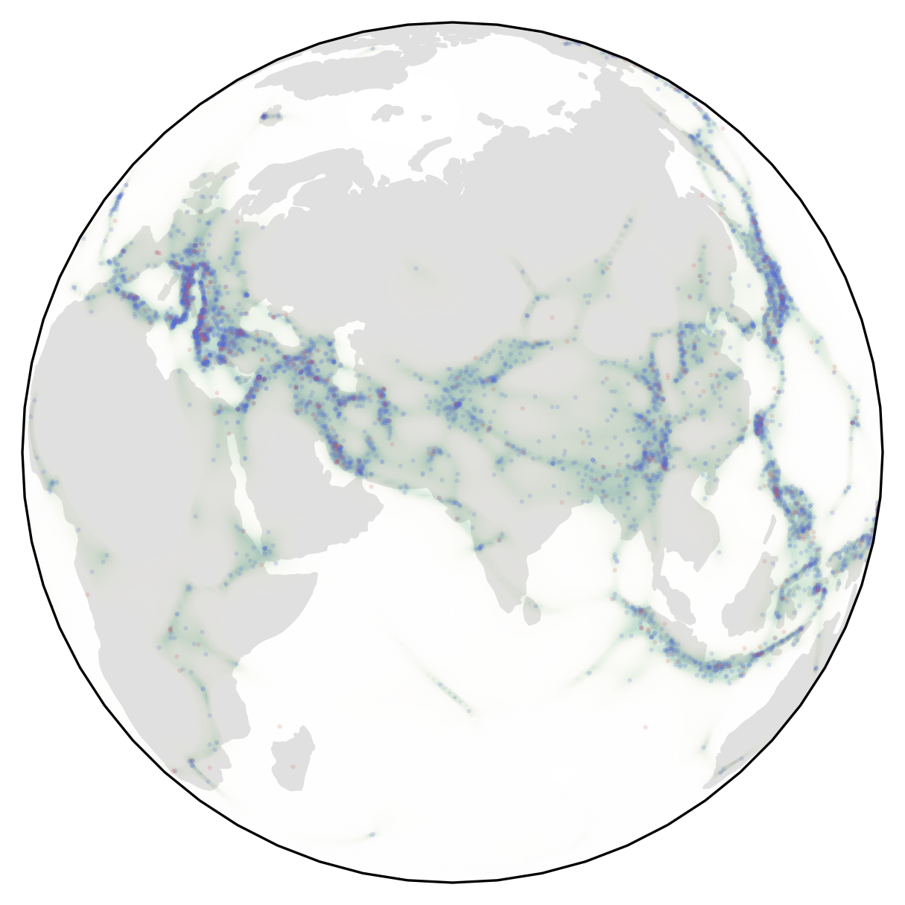
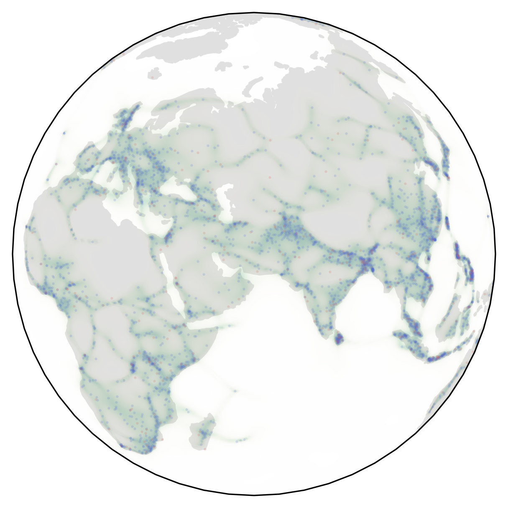
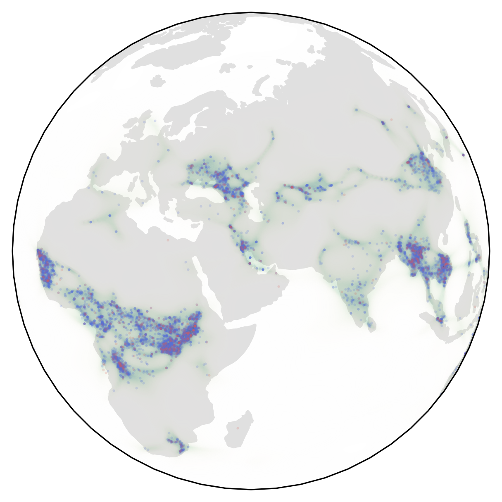
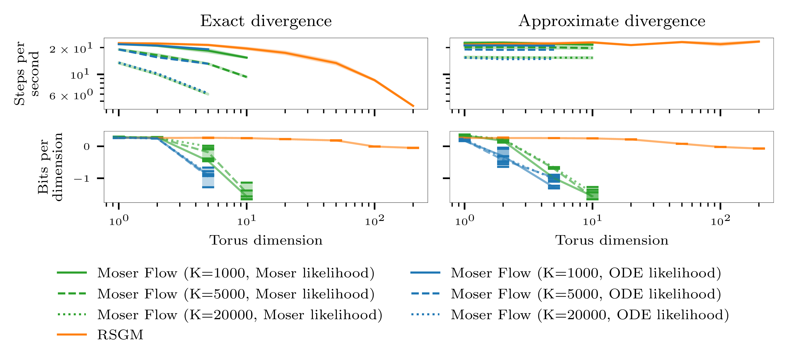

# [Riemannian Score-Based Generative Modelling](https://arxiv.org/abs/2202.02763)

This repo requires a modified version of [geomstats](https://github.com/geomstats/geomstats) that adds jax functionality, and a number of other modifications. This can be found [here](https://github.com/oxcsml/geomstats.git).

This repository contains the code for the paper `Riemannian Score-Based Generative Modelling`. This paper theoretically and practically extends score-based generative modelling (SGM) from Euclidean space to any connected and complete Riemannian manifold.

SGMs are a powerful class of generative models that exhibit remarkable empirical performance. Score-based generative modelling consists of a “noising” stage, whereby a diffusion is used to gradually add Gaussian noise to data, and a generative model, which entails a “denoising” process defined by approximating the time-reversal of the diffusion. 

## Install

Simple install instructions are:
```
git clone https://github.com/oxcsml/score-sde.git
cd score-sde
git clone https://github.com/oxcsml/geomstats.git 
virtualenv -p python3.9 venv
source venv/bin/activate
pip install -r requirements.txt
pip install -r requirements_exps.txt
GEOMSTATS_BACKEND=jax pip install -e geomstats
pip install -e .
```

- `requirements.txt` contains the core requirements for running the code in the `score_sde` and `riemmanian_score_sde` packages. NOTE: you may need to alter the jax versions here to match your setup.
- `requirements_exps.txt` contains extra dependencies needed for running our experiments, and using the `run.py` file provided for training / testing models. Also contains extra dependencies for using the job scheduling functionality of hydra.
- `requirements_dev.txt` contains some handy development packages.

## Code structure

The bulk of the code for this project can be found in 3 places
- The `score_sde` package contains code to run SDEs on Euclidean space. This code is modified from the code from the paper [Score-Based Generative Modeling through Stochastic Differential Equations](https://github.com/yang-song/score_sde).
- The `riemannian_score_sde` package contains code needed to extend the code in `score_sde` to Riemannian manifolds.
- An extended version of [geomstats](https://github.com/oxcsml/geomstats) that adds `jax` support, and a number of other extensions.

### Different classes of models
Most of the models used in this paper can be though of as a pushforward of a simple density under some continuous-time transformation into a more complex density. In code, this is represented by a `score_sde.models.flow.PushForward`, containing a base distribution, and in the simplest case, a time dependent vector field that defines the flow of the density through time.

A `Continuous Normalizing Flow (CNF) [score_sde.models.flow.PushForward]`
samples from the pushforward distribution by evolving samples from the base
measure under the action of the vector field. The log-likelihood is computed by
adding the integral of the divergence of the vector field along the sample path
to the log-likelihood of the point under the base measure. Models are trained by
optimising this log-likelihood of the training data.

`Moser flows [score_sde.models.flow.MoserFlow]` alleviate the expensive
likelihood computation in training using an alternative, cheaper, method of
computing the likelihood. This unfortunately requires a condition on the
pushforward vector field, which is enforced by a regularisation term in the
loss. As a result the cheaper likelihood computation unreliable, and the
sampling must still be done with expensive ODE solutions.

`Score-based Generative Models (SGMs) [score_sde.models.flow.SDEPushForward]`
instead consider a pushforward defined by the time-reversal of a noising
Stochastic Differential Equation (SDE). Instead of relying on likelihood based
training, these models are trained using score matching. The likelihood is
computed by converting the SDE to the corresponding likelihood ODE. While
identical in nature to the likelihood ODE of CNFs/Moser flows, these are
typically easier to solve computationally due the learned vector fields
being less stiff.

Other core pieces of code include:

- `score_sde/models/transform.py` which defines transforms between manifolds and Euclidean space, designed to allow for pushing a Euclidean density onto a manifold.
- `score_sde/models/vector_field.py` which contains various parametrisations of vector fields needed for defining the score functions / vector fields
- `score_sde/sde.py` which defines various SDEs
- `score_sde/losses.py` which contains all the loss functions used
- `score_sde/sampling.py` which provides methods for sampling SDEs
- `score_sde/ode.py` which provides methods for solving ODEs

and their counterparts in `riemannian_score_sde`.

### Model structure
Models are decomposed in three blocks:
- a `base` distribution, with `z ~ base` (a 'prior')
- a learnable diffeomorphic `flow: z -> y` (the flexible component of the model, potentially stochastic as for SGMs)
- a `transform` map `y -> x ∈ M` (if the model is *not* defined on the manifold and needs to be 'projected', else  the model is *Riemannian* and `transform=Id`)
Thus, the generative models are defined as `z -> y -> x`.

## Reproducing experiments
Experiment configuration is handled by [hydra](https://hydra.cc/docs/intro/), a highly flexible `yaml` based configuration package. Base configs can be found in `config`, and parameters are overridden in the command line. Sweeps over parameters can also be managed with a single command.

Jobs scheduled on a cluster using a number of different plugins. We use Slurm, and configs for this can be found in `config/server` (note these are reasonably general but have some setup-specific parts). Other systems can easily be substituted by creating a new server configuration.

The main training and testing script can be found in `run.py`, and is dispatched by running `python main.py [OPTIONs]`.

### Logging
By default we log to CSV files and to [Weights and biases](wandb.ai). To use weights and biases, you will need to have an appropriate `WANDB_API_KEY` set in your environment, and to modify the `entity` and `project` entries in the `config/logger/wandb.yaml` file. The top level local logging directory can be set via the `logs_dir` variable.

### $S^2 toy
To run a toy experiment on the sphere run:
`python main.py experiment=s2_toy`
This should validate that the code is installed correctly and the RSGM models are training properly.
### Earth datasets
We run experiments on 4 natural disaster experiments against a number of baselines.
|                           | Volcano                 | Earthquake              | Flood                  | Fire                    |
|:--------------------------|:------------------------|:------------------------|:-----------------------|:------------------------|
| Mixture of Kent | -0.80 ± 0.47 | 0.33 ± 0.05 | 0.73 ± 0.07 | 1.18 ± 0.06 |
| Riemannian CNF            | * -6.05 ± 0.61 | 0.14 ± 0.23      | 1.11 ± 0.19     | * -0.80 ± 0.54   |
| Moser Flow                | -4.21 ± 0.17   | * -0.16 ± 0.06   | * 0.57 ± 0.10   | * -1.28 ± 0.05   |
| Stereographic Score-Based (ours) | @ -3.80 ± 0.27 |  * -0.19 ± 0.05 |  0.59 ± 0.07   |  * -1.28 ± 0.12 |
| Riemannian Score-Based (ours)    |  -4.92 ± 0.25 |  * -0.19 ± 0.07 |  * 0.48 ± 0.09 |  * -1.33 ± 0.06 |

Examples of densities learned by RSGMs on the datasets:
| Volcano | Earthquake | Flood | Fire |
|:-|:-|:-|:-|
|  |  |  |  |

To run the full sweeps over parameters used in the paper run:

`RSGM ISM loss`:
```
python main.py -m \
    experiment=volcanoe,earthquake,fire,flood \
    model=rsgm \
    generator=div_free,ambient \
    loss=ism \
    flow.N=20,50,200 \
    flow.beta_0=0.001 \
    flow.beta_f=2,3,5 \
    steps=300000,600000 \
    seed=0,1,2,3,4
```
`RSGM DSM loss`:
```
python main.py -m \
    experiment=volcanoe,earthquake,fire,flood \
    model=rsgm \
    generator=div_free,ambient \
    loss=dsm0 \
    loss.thresh=0.0,0.2,0.3,0.5,0.8,1.0 \
    loss.n_max=-1,0,1,3,5,10,50 \
    flow.beta_0=0.001 \
    flow.beta_f=2,3,5 \
    seed=0,1,2,3,4
```
`Stereo RSGMs:`
```
python main.py -m \
    experiment=volcanoe,earthquake,fire,flood \
    model=stereo_sgm \
    generator=ambient \
    loss=ism \
    flow.beta_0=0.001 \
    flow.beta_f=4,6,8 \
    seed=0,1,2,3,4
```
`Moser flows`:
```
python main.py -m \
    experiment=volcanoe,earthquake,fire,flood \
    model=moser \
    loss.hutchinson_type=None \
    loss.K=20000 \
    loss.alpha_m=100 \
    seed=0,1,2,3,4
```
`CNF`:
```
python main.py -m \
    experiment=volcanoe,earthquake,fire,flood \
    model=cnf \
    generator=div_free,ambient \
    steps=100000 \
    flow.hutchinson_type=None \
    optim.learning_rate=1e-4 \
    seed=0,1,2,3,4
```
`Mixture of Kent`
```
python scripts/kent/run_kent.py -m seed=1,2,3,4,5 dataset=fire,flood,quakes_all,volerup n_components=5,10,15,20,25 iterations=50,100,150

python
```

### High dimension torus example
To demonstrate the scaling of our method to high dimension manifolds we train RSGMs on products of circles to give high dimension toruses. We compare to the performance of Moser flows, the next most scalable method.


The commands to run the experiments shown in the plots are:
`RSGMs`:
```
python main.py -m \
    experiment=tn \
    n=1,2,5,10,20,50,100,200 \
    architecture.hidden_shapes=[512,512,512] \
    loss=ism,ssm \
    seed=0,1,2
```
`Moser flows`:
```
python main.py -m \
    experiment=tn \
    n=1,2,5,10,20,50,100,200 \
    model=moser \
    loss.hutchinson_type=None,Rademacher \
    loss.K=1000,5000,20000 \
    loss.alpha_m=1 \
    architecture.hidden_shapes=[512,512,512] \
    seed=0,1,2
```


### SO(3)
To demonstrate that RSGMs can handle Lie groups as well, we train RSGMs and Moser flows on mixtures of wrapped normal distributions on $SO(3)$. We also show the number of function evaluations required to solve the likelihood ODE for each model in each case, demonstrating the difficulties Moser flows face due to the stiff vector fields they learn.

| Method          | N=16, log-likelihood                               | N=16, NFE                                  | N=32, log-likelihood                               | N=32, NFE                                  | N=64, log-likelihood                                | N=64, NFE                                  |
|:----------------|:-----------------------------------------------|:---------------------------------------------|:-----------------------------------------------|:---------------------------------------------|:------------------------------------------------|:---------------------------------------------|
| Moser Flow      | 0.85 ± 0.03                            | 2.3 ± 0.5                            | 0.17 ± 0.03                            | 2.3 ± 0.9                            | * -0.49 ± 0.02                         | 7.3 ± 1.4                            |
| Exp-wrapped SGM |  * 0.87 ± 0.04 |  0.5 ± 0.1    |  0.16 ± 0.03    |  0.5 ± 0.0    |  -0.58 ± 0.04    |  0.5 ± 0.0    |
| RSGM            |  * 0.89 ± 0.03 |  * 0.1 ± 0.0 |  * 0.20 ± 0.03 |  * 0.1 ± 0.0 |  * -0.49 ± 0.02 |  * 0.1 ± 0.0 |

`RSGMs`
```
python main.py -m \
    experiment=so3 \
    model=rsgm \
    dataset.K=16,32,64 \
    steps=100000 \
    loss=dsmv \
    generator=lie_algebra \
    optim.learning_rate=5e-4,2e-4 \
    flow.beta_f=2,4,6,8,10 \
    seed=0,1,2,3,4
```
`Exp RSGMs`
```
python main.py -m \
    experiment=so3 \
    model=tanhexp_sgm \
    dataset.K=16,32,64 \
    steps=100000 \
    optim.learning_rate=5e-4,2e-4 \
    flow.beta_f=2,4,6,8,10 \
    seed=0,1,2,3,4
```
`Moser flows`
```
python main.py -m \
    experiment=so3 \
    model=moser \
    dataset.K=16,32,64 \
    steps=100000 \
    optim.learning_rate=5e-4,2e-4 \
    loss.K=1000,10000 \
    loss.alpha_m=1,10,100 \
    seed=0,1,2,3,4
```

### Hyperbolic space
So as to show that RSGMs is also suited for non-compact manifolds, we train RSGMs and an exponential map wrapped SGM baseline on mixtures of wrapped normal distributions on $H^2$.
We observed more numerical stability working with the hyperboloid model of hyperbolic geometry, but one can similarly run this experiment on the Poincaré ball with `experiment=poincare`.

`RSGMs`
```
python main.py -m \
    experiment=hyperboloid \
    model=rsgm \
    steps=100000 \
    seed=0,1,2,3,4
```
`Exp RSGMs`
```
python main.py -m \
    experiment=hyperboloid \
    model=exp_sgm \
    loss=dsm0 \
    generator=canonical \
    flow=vp \
    steps=100000 \
    seed=0,1,2,3,4
```